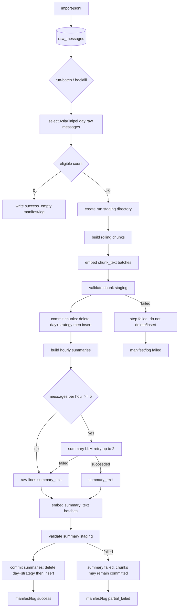

# Batch Pipeline 設計紀錄

本文件收斂日終批次 pipeline、歷史 backfill、冪等性、成本控制與 observability。
本輪不重新討論 schema、runtime request flow、Discord event handling、部署架構或 normalized content 清洗規則。

## 固定背景

- 4 人 Discord 群組，歷史約 60 萬則，日常增量約幾十到幾百則。
- runtime 只即時寫入 `raw_messages`；`conversation_chunks`、`hourly_summaries` 與 embeddings 由 batch 產生。
- batch source-of-truth 是 `raw_messages`，只處理 `is_rag_eligible=true` 的訊息。
- 所有 batch day/hour boundary 使用 Asia/Taipei。
- `conversation_chunks.chunk_key` 與 `hourly_summaries.summary_key` 是 deterministic artifact identity，不包含 `batch_id`。
- `batch_id` 只用於排查來源，例如 `chunk-YYYY-MM-DD-rN`、`summary-YYYY-MM-DD-rN`。
- `EMBEDDING_MODEL=text-embedding-3-small`，正式表 embedding 維度為 1536。

## Mermaid Flow

## CLI Commands

第一版 batch 只提供明確 CLI command，由 cron、人工或未來 scheduler 呼叫；不內建在 Discord bot process。

- `import-jsonl --input-dir ...`
  - 只匯入 JSONL 到 `raw_messages`。
  - 以 `message_id` upsert，重跑同一檔不產生重複 rows。

- `run-batch --date YYYY-MM-DD --only all|chunks|summaries [--dry-run]`
  - 處理指定 Asia/Taipei day。
  - `all` 固定先 chunks，後 summaries。
  - `chunks` / `summaries` 可單獨重跑。

- `backfill --start YYYY-MM-DD --end YYYY-MM-DD --only all|chunks|summaries --resume [--dry-run]`
  - 用同一套 batch pipeline 逐日處理歷史 raw。
  - 以 day 為最小 commit/resume 單位。
  - 預設 continue-on-error；有任何 failed day 時最終 exit non-zero。

- `check-batch --date YYYY-MM-DD --json`
  - 只輸出 JSON。
  - exit code 表示檢查是否通過。

- `cleanup-batches --older-than-days N`
  - 清理超過 retention 的 staging run directories。

## Day Boundary 與 Rerun

- 日終 batch 固定在 Asia/Taipei 00:30 處理昨天完整日 `[D 00:00, D+1 00:00)`。
- chunks 不跨 Asia/Taipei 日界線。
- rerun 同一天同 strategy 時，先在 staging 完成所有計算與 embeddings，validate 通過後才短交易替換正式表。
- delete 舊 artifacts 不靠 `batch_id`：
  - chunks: `chunk_strategy_version` + `start_at` 落在該 day。
  - summaries: `summary_strategy_version` + `hour_start` 落在該 day。
- `--resume` 以 DB artifacts + expected deterministic keys 判斷成功，不以 manifest 作唯一 source-of-truth。
- 若 raw 補寫或修正導致 expected keys 改變，該 day 視為 stale，重跑整個 day。
- 0 eligible day 標記 `success_empty`，不產 artifacts；`--resume` 以 raw DB 即時計算 eligible count=0 判斷成功空日。

## Staging

每次 batch run 建立獨立 staging directory，保存至少 30 天，之後由 `cleanup-batches` 或人工清理。

staging directory 內容：

- `manifest.json`
- `chunks.jsonl`
- `summaries.jsonl`
- `errors.jsonl`

每個 staging JSONL 完成後計算 SHA-256，寫入 manifest。commit 前必須 validate staging artifacts；validation 失敗時不刪舊、不插新。

validation 最低檢查：

- expected count / actual count。
- key uniqueness。
- required fields。
- embedding length 必須等於 1536。
- artifact keys 符合 deterministic 格式。

## Chunk Pipeline

輸入：同一 Asia/Taipei day 內 eligible `raw_messages`，依 `created_at, message_id` 排序。

切分策略：

- `CHUNK_WINDOW_MESSAGES=20`
- `CHUNK_STRIDE_MESSAGES=10`
- `MIN_CHUNK_MESSAGES=5`
- tail 不足 5 則不產 chunk。
- raw 補寫造成 rolling window boundary 改變時，重跑整個 day，不做局部 window 修補。

`chunk_key`：

- human-readable deterministic 格式。
- 包含 chunk strategy version、day boundary、`start_message_id`、`end_message_id`。
- 不包含 `batch_id`，不使用 window index 作 artifact identity。

`chunk_text`：

- 每則訊息一行。
- 每行包含 Asia/Taipei 時間、`author_id`、`normalized_content`。
- 上限 `CHUNK_TEXT_MAX_CHARS=8000`。
- 超過時保留開頭與結尾，中間截斷。
- truncation metadata 只記 manifest/log，不寫正式 artifact table。

## Summary Pipeline

輸入：每個 Asia/Taipei hour 內 eligible `raw_messages`。

策略：

- summaries 直接從 raw hourly messages 產生，不依賴 chunks。
- 無 eligible 訊息的小時不建 row。
- `MIN_SUMMARY_LLM_MESSAGES=5`。
- 少於 5 則 eligible messages 的小時不打 LLM，直接使用格式化 raw lines 作為 `summary_text`。
- summary LLM 最多 retry 2 次；仍失敗 fallback 到 raw lines。
- raw-lines fallback 上限 `SUMMARY_FALLBACK_MAX_CHARS=4000`，超過截斷並記 log/manifest。
- summary LLM input token budget 為 `SUMMARY_INPUT_TOKEN_BUDGET=6000`。
- input 超過 budget 時保留該小時開頭與結尾訊息，中間截斷。
- summary LLM output 上限 `SUMMARY_MAX_OUTPUT_TOKENS=300`。

summary prompt 約束：

- 只摘要輸入訊息中明確出現的內容。
- 不補全。
- 不做人格評價。
- 不推論長期偏好。

`summary_key`：

- human-readable deterministic 格式。
- 包含 summary strategy version、hour boundary、`start_message_id`、`end_message_id`。
- 不包含 `batch_id`。
- 不包含 summary text hash、fallback 狀態或 truncation 狀態。

## Model 與版本參數

- `SUMMARY_MODEL=<to-be-selected>`；summary LLM model 由環境變數指定，實作前仍需選定具體 model id。
- `EMBEDDING_MODEL=text-embedding-3-small`；與正式表 `vector(1536)` 耦合，第一版不做任意切換。
- `CHUNK_STRATEGY_VERSION` 與 `SUMMARY_STRATEGY_VERSION` 必須由環境變數提供，缺失時 batch command 應 fail fast。
- chunk / summary / embedding / staging 參數以 `.env.example` 為設定清單，修改後由下一次 CLI run 生效；不做 DB config 或熱更新。

## Embedding Pipeline

chunks 與 summaries 共用 embedding 策略：

- `EMBEDDING_MODEL=text-embedding-3-small`
- `EMBEDDING_BATCH_SIZE=100`
- 外部 API 單 worker 串行處理。
- 不使用 OpenAI Batch API。
- 每批最多 retry 3 次，使用 exponential backoff + jitter。
- batch 仍失敗時，二分拆分定位失敗單筆。
- 單筆仍失敗時寫 `errors.jsonl`，該 artifact step failed。
- 缺 embedding 的 artifact 不 commit 到正式表。
- embedding 維度不等於 1536 時直接 fail step，不截斷、不 padding。

## Partial Failure

- `all` pipeline 順序固定：chunks 完整成功後，再跑 summaries。
- chunks commit 成功但 summaries 失敗時，chunks 保留，整體 run 標記 `partial_failed`。
- `run-batch all` 若 `partial_failed`，command exit non-zero。
- 後續可用 `--only summaries` 補跑。
- success_empty、failed、partial_failed 都必須寫 manifest 與 structured log。

## Dry Run

`run-batch` 與 `backfill` 支援 `--dry-run`：

- 計算日期範圍。
- 查 eligible raw counts。
- 計算 expected chunk/summary counts。
- 估算 tokens/cost。
- 不呼叫外部 API。
- 不寫 artifacts。
- 不刪正式表。

dry-run 只要計算成功就 exit 0，即使 expected artifacts 為 0；設定、DB 或參數錯誤才 exit non-zero。

## Cost Estimate

成本估算單價走環境變數/config，不硬編在程式碼。單價缺失時，batch 繼續執行，manifest cost 欄位記 `unknown` 並輸出 warning log。

估算假設：

- 60 萬歷史 raw messages。
- 先用 15 / 30 / 60 tokens per eligible message 做 range，之後用 tokenizer 實測校正。
- rolling chunks `size=20, stride=10`，約 6 萬 chunks。
- summary LLM input 依 hourly raw tokens，上限 6000。
- summary LLM output 每 summary 最多 300 tokens。

| 項目 | 歷史一次性 backfill | 日常增量 |
|---|---:|---:|
| raw import | 60 萬 messages upsert | runtime 已即時寫 raw |
| chunks | 約 6 萬 chunks | 約 `eligible_messages / 10` chunks |
| chunk embedding tokens | 約 18M / 36M / 72M | 依每日 messages 線性增加 |
| summaries | 依有訊息的小時計，最多約歷史小時數 | 每日最多 24 個 summaries |
| summary LLM input | 每小時 raw tokens，上限 6000 | 每日最多 24 小時 input |
| summary LLM output | 每 summary 最多 300 tokens | 每 summary 最多 300 tokens |
| summary embedding | summary_text tokens | summary_text tokens |
| 成本精度 | 初估，待 tokenizer 掃 DB 校正 | manifest 每次記 token/cost |

## Observability

第一版 batch observability 使用 staging manifest + structured JSON logs；不新增 `batch_runs` DB table。

Structured log 最低 event names：

- `batch_started`
- `batch_step_started`
- `batch_step_finished`
- `batch_step_failed`
- `batch_partial_failed`
- `batch_finished`
- `artifact_validation_failed`
- `api_retry`
- `api_fallback`
- `artifact_committed`

每個 step 共同欄位：

- `run_id`
- `batch_id`
- `date`
- `only`
- `strategy_version`
- `status`
- `duration_ms`
- `input_count`
- `output_count`
- `expected_count`
- `actual_count`
- `error_count`
- `retry_count`
- `token_input`
- `token_output`
- `estimated_cost`
- `started_at`
- `finished_at`

manifest 最低欄位：

- date range / day。
- chunk batch id / summary batch id。
- chunk strategy version / summary strategy version。
- input raw counts。
- expected artifact counts。
- actual artifact counts。
- step status。
- started_at / finished_at。
- error counts。
- token usage。
- estimated cost。
- cost unit prices used，或 `unknown`。
- staging file paths。
- staging file SHA-256 checksums。
- fallback/truncation counts。
- failed days for range runs。

`errors.jsonl` 禁止寫完整 raw content，只記：

- artifact key。
- message ids / hour。
- step。
- error type。
- error summary。
- retry count。
- provider request id / response id。

## Usage Source

第一版 `/usage` 資料來源是 structured JSON logs 的離線彙整。

- 不新增 DB usage table。
- 不提供 bot 內即時 DB 查詢。
- runtime request logging 與 batch logging 都應提供 token/cost metadata，供離線彙整。

## 設計決策摘要

- JSONL import 與 artifact batch 是兩個分開 command。
- 歷史 backfill 與日常增量共用同一套 day-level pipeline。
- batch commit 採 staging-first、validate-first、短交易 replace。
- deterministic keys 是冪等性核心；`batch_id` 不參與 identity。
- rolling chunks 提高 recall，但接受 overlap 造成的重複 retrieval noise。
- summaries 從 raw hourly messages 直接產生，避免 rolling chunk overlap 污染摘要。
- 外部 API 第一版單 worker 串行，降低 rate limit 與 failure recovery 複雜度。
- partial artifacts 可用；chunks 成功、summaries 失敗時不 rollback chunks。
- observability 第一版靠 manifest 與 structured logs，不改 schema。
