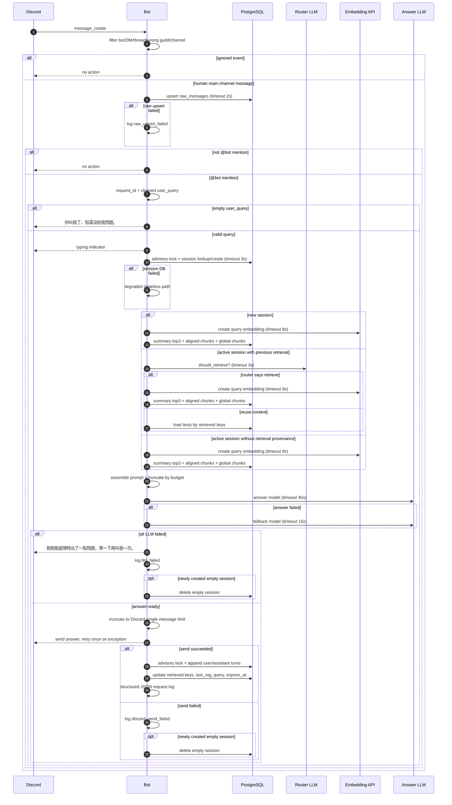

# Runtime Request Flow 設計紀錄

本文件收斂一次 `@bot` mention 從 Discord event 到 bot 回覆的 runtime 流程。
本輪只定義請求流程、fallback、可調參數與資料流邊界；不重新討論 schema、batch pipeline、部署架構或 slash command。

## 固定背景

- 4 人 Discord 群組，單一 guild、單一主要 channel。
- 第一版忽略 Discord threads，不支援 DM。
- `@bot` mention 觸發；非 mention 真人訊息只寫 raw，不觸發 LLM。
- 所有 bot authored message 都忽略，不寫入 raw，不進 RAG。
- `raw_messages` 是真人訊息 source-of-truth。
- `conversation_chunks` 與 `hourly_summaries` 由日終 batch 產生。
- DDL 只能由明確 migration command 執行；bot 啟動與 Docker entrypoint 不自動套 schema。
- model selection、answer/router prompt、normalization / eligibility 與 runtime structured log 合約由本文件管理；batch、CLI、migration 與 Compose 邊界見 `batch_pipeline.md`。

## Mermaid Sequence



## Request Flow Sequence

1. Discord `message_create` 進來後，先過濾 bot author、DM、thread、非指定 guild、非主要 channel。
2. 真人主 channel 訊息嘗試 upsert `raw_messages`，timeout 2 秒；失敗或 timeout 只記 log，不阻塞 mention flow。
3. `raw_content` 保留 Discord 原始 content，包含 mention token；`normalized_content` 保存共用 normalization 規則清理後文字。
4. `@bot` mention 訊息一律 `is_rag_eligible=false`；非 mention 真人訊息才依本文件的共用 eligibility 規則判定。
5. 非 `@bot` mention 真人訊息在 raw upsert 後結束，不進 session、不延長 timeout、不觸發 RAG/LLM。
6. `@bot` mention 產生 UUID `request_id`，移除 bot mention token 後得到 `user_query`。
7. 若 `user_query` 為空，固定回覆「你叫我了，但還沒給我問題。」；不建立或更新 session，不走 RAG/LLM。
8. 有效 query 進入 typing indicator，讓 Discord 顯示 bot 正在處理。
9. 使用 Postgres advisory lock 保護短交易的 session lookup/create；lock key 以 `(namespace, channel_id)` 產生。
10. advisory lock 不包住 LLM 呼叫；同 channel 多個 mention 可並行呼叫 LLM，最後再用短交易排隊寫 session。
11. session lookup/create timeout 或失敗時，走 stateless degraded path：不使用 session turns、不沿用 retrieval，可嘗試新 RAG。
12. 新 session 的第一個 mention 一律執行 RAG retrieval。
13. active session 若有 retrieved keys 與 `last_rag_query`，先用 router LLM 判斷是否重查 RAG。
14. router 輸入包含 current user query、`last_rag_query`、最近 4 個 session turns；輸出 JSON。
15. router timeout、API 失敗或 JSON 解析失敗時視為 `should_retrieve=false`，沿用既有 retrieval context。
16. active session 若沒有 retrieved keys 或 `last_rag_query`，跳過 router，直接重新執行 RAG。
17. RAG 先產生 query embedding；embedding timeout 或失敗時跳過 RAG，走一般 AI。
18. retrieval 先查 `hourly_summaries topK=3`，必須 filter `summary_strategy_version`。
19. 每個 summary hour window 內，用 overlap 條件查 aligned chunks：`chunk.start_at < summary.hour_end AND chunk.end_at >= summary.hour_start`。
20. 每個 summary hour 取 query embedding cosine distance 最相近 chunks top2，最多 6 個 aligned chunks。
21. 另外查 global `conversation_chunks topK=2` 作為 summary miss fallback，必須 filter `chunk_strategy_version`。
22. retrieval 子查詢各自 timeout 3 秒；summary、aligned chunks、global chunks 允許 partial RAG。
23. query embedding 失敗，或所有 retrieval 子查詢都失敗/無結果，才走 no-context 一般 AI。
24. retrieval 成功但無結果不是系統錯誤，走一般 AI 並 log `retrieval_empty`。
25. retrieval 結果以 `chunk_key` 去重；aligned chunks 優先，global fallback 只補不重複 chunk。
26. active session 沿用 retrieval 時，只在 session 保存 keys，組 prompt 前回 DB 重讀 summary/chunk text。
27. 沿用 keys 回讀 context 時，缺幾筆跳過；全部缺失則 no-context 一般回答並 log `retrieval_context_missing`。
28. prompt 組裝順序為：system prompt、retrieved summaries 與 grouped aligned chunks、global fallback chunks、recent session turns、current user query。
29. prompt 超過 token budget 時，保留 system prompt、current user query 與最近 session turns；先砍 chunks，再砍 summaries，最後才砍舊 session turns。
30. RAG context 最多佔 prompt input token budget 的 40%。
31. answer LLM 與 router LLM 統一走 OpenAI Responses API；第一版不 streaming。
32. answer LLM 主模型 timeout 45 秒；失敗或 timeout 後直接 fallback model 一次，timeout 15 秒。
33. answer 與 fallback 都失敗時，固定回覆：「我剛剛處理時出了一點問題，等一下再叫我一次。」
34. LLM 回覆超過 Discord 單則訊息限制時，截斷成單則訊息並加簡短截斷提示，不拆多則。
35. Discord send 失敗時 retry 一次；仍失敗不更新 session，log `discord_send_failed`。
36. Discord send 成功後，才用短交易 append 本次 user turn 與 assistant turn。
37. 只有 Discord send 成功後，才更新 `retrieved_chunk_keys`、`retrieved_summary_keys`、`last_rag_query`、`last_interaction_at`、`expires_at`。
38. session update 失敗時 retry 一次；仍失敗只 log `session_update_failed_after_send`，不撤回 Discord 訊息。
39. 若本次新建 session 但最終沒有成功送出 Discord 回覆，刪除該空 session。
40. 既有 session 遇到 LLM 或 Discord 最終失敗時，不更新 `last_interaction_at` 或 `expires_at`。
41. request logging 使用 structured JSON application log，不新增 DB request log table。
42. request log 禁止寫入完整 prompt 或完整 retrieved text，只記 metadata、keys、狀態摘要、model、token usage 與 failure flags。

## Prompt 結構

prompt 組裝的語意是「session 與 current query 為主，RAG context 只做背景強化」。

```text
system prompt

群組背景摘要與對應片段:
- summary 1, relevance order
  - aligned chunk 1
  - aligned chunk 2
- summary 2
  - aligned chunk 1
  - aligned chunk 2

其他可能相關對話片段:
- global fallback chunk 1
- global fallback chunk 2

最近 session turns:
- user / assistant ...

current user query
```

RAG、partial RAG、no-context 一般回答都使用同一份 answer system prompt；差異只在 context 區塊是否存在。

## Prompt Contracts

### Answer System Prompt

第一版 answer system prompt 使用 repo 內固定文字檔，預設路徑為 `prompts/answer_system.md`；修改後重啟生效，不做 prompt 管理系統或 hot reload。

prompt 必須包含以下行為合約：

- 明確說明自己是 Discord 群組裡的 AI bot，不是群組真人成員。
- 可以使用提供的群組背景與最近對話讓回答更貼近群組脈絡。
- 沒有提供群組背景或背景不足時，仍可用一般 AI 能力回答，但不得假裝知道群組歷史。
- 群組背景與一般知識衝突時，回答應優先採用群組背景；若不確定，需明確保留不確定性。
- 不把推測包裝成歷史事實；避免未被 context 支援的「某人說過」、「某人喜歡」、「某人常常」。
- 不做負面人格判斷、嘲諷式標籤或冒犯性歸類。
- 不在使用者可見回覆中暴露 RAG、chunk、embedding、summary、prompt 等技術詞。
- 不宣稱自己可驗證歷史、統計訊息、查證誰何時說過什麼，除非未來另有明確工具實作。
- 回覆應以使用者當前問題與最近 session 為主；retrieved context 只作背景補強。
- 回答要像 Discord 群組裡直接回話，不像客服或通用 GPT；除非使用者明確要求下一步、選項、改寫、整理或計畫，否則不要在結尾加「如果你需要，我可以...」、「需要的話我也可以...」這類泛用助理式服務尾巴。

Prompt file 可以直接用上述合約改寫成自然語言 system prompt，但不得加入未收斂的產品聲音、角色扮演人格、安全政策或引用格式。

### Router `should_retrieve` Prompt

第一版 router prompt 使用 repo 內固定文字檔，預設路徑為 `prompts/router_should_retrieve.md`；修改後重啟生效。

Router prompt 的唯一目的，是判斷 active session 是否需要重新查 RAG。輸入固定包含：

- current user query。
- previous `last_rag_query`。
- 最近最多 `ROUTER_SESSION_TURNS` 個 session turns。

Router 輸出必須是 JSON object：

```json
{
  "should_retrieve": true,
  "reason": "short reason"
}
```

`should_retrieve=true` 的情況：

- 使用者換了新主題。
- 使用者要求更多群組背景、過去對話、成員脈絡或 inside joke。
- 目前問題明顯無法只靠上一輪 retrieval context 回答。
- 上一輪 `last_rag_query` 與 current user query 的資訊需求不同。

`should_retrieve=false` 的情況：

- 使用者只是追問、改寫、澄清、要求延伸上一輪回答。
- 使用者問一般 AI 問題，且不需要群組長期記憶。
- router timeout、API error 或 JSON parse error；runtime flow 已定義此時沿用既有 context。

Router 不得回答使用者問題，不得產生 Discord 可見文字，也不得決定模型、topK、prompt budget 或 session 更新策略。

## Shared Normalization / Eligibility

runtime Discord ingestion 與 JSONL import 必須呼叫同一套純函式規則，避免歷史資料與新訊息進入不同記憶邏輯。

Normalization input 至少包含：

- `message_id`
- `created_at`
- `author_id`
- `raw_content`
- `is_bot_author`
- 是否來自 DM、thread、非指定 guild、非主要 channel
- 是否包含本 bot mention
- attachments / stickers / embeds / reactions 是否存在的 metadata

Normalization output 固定包含：

- `normalized_content: str`
- `is_rag_eligible: bool`
- `eligibility_reason: str`

`eligibility_reason` 只供 log、test、debug 使用，不寫入目前 schema，除非未來另開 schema issue。

Normalization rules：

- `raw_content` 以 Discord 原始 content 保存，不做覆寫。
- `normalized_content` 移除本 bot mention token、首尾空白與控制字元。
- 多個連續空白可壓成單一空白；換行可保留為換行或壓成空白，但 runtime 與 import 必須一致。
- 不翻譯、不摘要、不改寫語氣、不替換 author id。
- URL 保留原文；第一版不抓網頁標題或外部內容。
- custom emoji、純 unicode emoji、貼圖、附件只靠文字 content 判定；第一版不解析圖片或附件。

`is_rag_eligible=false`：

- bot authored message。
- DM、thread、非指定 guild、非主要 channel。
- 空 `normalized_content`。
- 真人 `@bot` mention 訊息。
- 純 mention、純 emoji、純貼圖、純附件，且沒有其他文字內容。
- Discord system message 或 importer 無法確認為真人文字訊息的資料。

`is_rag_eligible=true`：

- 指定 guild / channel 內真人非 mention 訊息。
- `normalized_content` 非空。
- 訊息文字可獨立作為群組記憶素材。

Normalization 不做品質評分、禁用詞清單、inside joke 清單、人格標籤、人工審核或 opt-out。

## 數字參數

| 參數 | 初始值 | 調整方式 |
|---|---:|---|
| `RAW_UPSERT_TIMEOUT_SECONDS` | 2 | env |
| `SESSION_DB_TIMEOUT_SECONDS` | 3 | env |
| `SESSION_TIMEOUT_MINUTES` | 15 | env |
| `SESSION_PROMPT_TURNS` | 8 | env |
| `SESSION_STORED_TURNS` | 20 | env |
| `ROUTER_TIMEOUT_SECONDS` | 3 | env |
| `ROUTER_SESSION_TURNS` | 4 | env |
| `ROUTER_MAX_OUTPUT_TOKENS` | 128 | env |
| `QUERY_EMBEDDING_TIMEOUT_SECONDS` | 8 | env |
| `SUMMARY_TOP_K` | 3 | env |
| `ALIGNED_CHUNKS_PER_SUMMARY` | 2 | env |
| `ALIGNED_CHUNKS_MAX` | 6 | env |
| `GLOBAL_CHUNK_FALLBACK_TOP_K` | 2 | env |
| `RETRIEVAL_DB_QUERY_TIMEOUT_SECONDS` | 3 | env |
| `PROMPT_INPUT_TOKEN_BUDGET` | 12000 | env |
| `RAG_CONTEXT_BUDGET_RATIO` | 0.4 | env |
| `ANSWER_MAX_OUTPUT_TOKENS` | 1024 | env |
| `ANSWER_TIMEOUT_SECONDS` | 45 | env |
| `FALLBACK_TIMEOUT_SECONDS` | 15 | env |
| `DISCORD_SEND_RETRY_COUNT` | 1 | env |
| `SESSION_UPDATE_RETRY_COUNT` | 1 | env |

## Model 與版本參數

| 參數 | 初始值 | 調整方式 |
|---|---|---|
| `ANSWER_MODEL` | `gpt-5.4-mini` | env |
| `FALLBACK_MODEL` | `gpt-5.4-mini` | env |
| `ROUTER_MODEL` | `gpt-5.4-mini` | env |
| `EMBEDDING_MODEL` | `text-embedding-3-small` | env，但與 schema 維度耦合 |
| `CHUNK_STRATEGY_VERSION` | required | env，缺失則啟動失敗 |
| `SUMMARY_STRATEGY_VERSION` | required | env，缺失則啟動失敗 |
| answer system prompt | repo text file | 修改後重啟；合約見本文件 |
| router prompt | repo text file | 修改後重啟；合約見本文件 |

`EMBEDDING_MODEL` 第一版不做任意切換；目前 DDL 使用 `vector(1536)`，與 `text-embedding-3-small` 相容。

## 啟動與設定驗證

bot 啟動時必須 validate 所有必要設定：

- `BOT_TOKEN`、`GUILD_ID`、`CHANNEL_ID`。
- `CHUNK_STRATEGY_VERSION`、`SUMMARY_STRATEGY_VERSION`。
- timeout 必須大於 0。
- topK 與 retry count 不得小於 0。
- session turns 與 token budget 必須大於 0。
- `RAG_CONTEXT_BUDGET_RATIO` 必須介於 0 與 1。
- prompt file path 必須存在且可讀。

設定不合法時 fail fast，不等到第一次 mention 才爆。

## 設計決策摘要

- raw archive 與 reply flow 解耦；raw upsert 失敗不影響 reply。
- session 狀態只代表成功送出的對話，不記錄使用者沒有看到的 assistant turn。
- RAG 失敗、retrieval empty、session DB 失敗都可 degraded 到一般 AI；LLM/API 最終失敗才回固定錯誤文案。
- retrieval 採 summary-first hybrid，兼顧 summary/chunk 時間對齊與 global chunk fallback。
- prompt 明確維持 session/current query 優先，RAG context 只是補強。
- Discord rate limit 交給 `discord.py`，應用層不做自訂 queue 或 scheduler。
- 所有 runtime 可調參數走環境變數，修改後重啟生效；不做 DB config 或熱更新。

## Runtime Structured Logs

runtime request logging 使用單行 structured JSON application log，不新增 DB request log table 或 usage table。

Common required fields：

- `event`
- `request_id`
- `timestamp`
- `level`
- `component`
- `status`
- `duration_ms`

Runtime request log fields：

- `guild_id`
- `channel_id`
- `message_id`
- `session_id`
- `is_degraded`
- `router_decision`
- `retrieval_status`
- `retrieved_chunk_keys`
- `retrieved_summary_keys`
- `answer_model`
- `fallback_model`
- `router_model`
- `embedding_model`
- `token_input`
- `token_output`
- `estimated_cost`
- `failure_flags`

`request_id` 必須貫穿 raw upsert、session、retrieval、LLM call、Discord send 與 final request log。

runtime logs 不得寫入完整 prompt、完整 retrieved text、完整 `raw_content` 或 `normalized_content`、Discord token、OpenAI API key、DB password、完整 connection string、未截斷的 provider request / response body。允許記錄 metadata、artifact keys、message ids、狀態摘要、短錯誤摘要、provider request id / response id。
